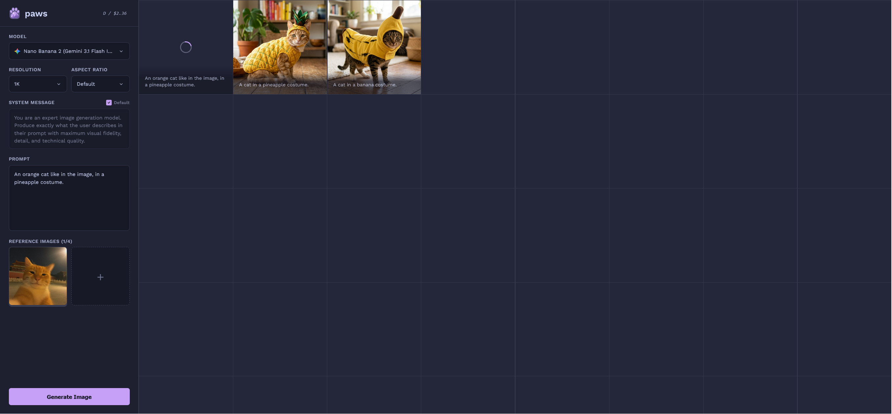

# paws



paws is a private, self-hosted web interface for generating images via AI models available on [OpenRouter](https://openrouter.ai/).

## Features

### Core Functionality
- **Private & Self-Hosted**: All your generated images and settings are stored locally in `indexedDB`.
- **Broad Model Support**: Use any image generation model available on your OpenRouter account.
- **Real-time Streaming**: Watch images materialize in real-time via streaming generation chunks.
- **Persistent Settings**: Your chosen model, resolution, aspect ratio, and prompt history are saved between sessions.
- **Authentication**: Optional user/password authentication for added security.

### Generation Control
- **Reference Images**: Attach up to 4 reference images to guide the generation (vision models).
- **Resolution & Aspect Ratio**: Explicitly request `1K`, `2K`, or `4K` resolutions and specific aspect ratios (or let the model decide).
- **System Messages**: Use the built-in optimal system prompt or provide your own custom instructions.
- **Prompt History**: Your last prompt is saved locally so you can pick up where you left off.

### Rich UI & UX
- **Grid Gallery**: View all your generated images in a responsive, dynamic grid.
- **Image Specifications**: See the requested resolution and calculated aspect ratio directly on the image card.
- **Advanced Model Selection**:
  - Pricing badges show costs for `1K`, `2K`, and `4K` generations.
  - Fuzzy search helps you quickly find the exact model you need.
  - Favorite models and drag-and-drop to reorder them for quick access.
- **Usage Tracking**: Keep track of your spending with a clickable usage display that cycles through daily, weekly, monthly, and total costs.
- **Download & Retry**: Easily download high-resolution results or retry failed generations.

## Built With

**Frontend**
- Vanilla JavaScript and CSS
- [Dexie](https://dexie.org/) for IndexedDB storage
- [msgpackr](https://github.com/kriszyp/msgpackr) for efficient streaming data transfer
- Color palette: [Catppuccin Macchiato](https://catppuccin.com/)

**Backend**
- Go
- [chi/v5](https://go-chi.io/) for the http routing/server
- [OpenRouter](https://openrouter.ai/) for model list and image generation

## Getting Started

1. Copy `example.config.yml` to `config.yml` and set `tokens.openrouter`:
```bash
cp example.config.yml config.yml
```

2. Build and run:
```bash
go build -o paws
./paws
```

3. Open `http://localhost:3444` in your browser.

### Configuration (`config.yml`)

```yaml
# enable verbose logging and diagnostics
debug: false

tokens:
  # server secret for signing auth tokens; auto-generated if empty
  secret:
  # openrouter.ai api token (required)
  openrouter:

server:
  # port to serve paws on (required; default 3444)
  port: 3444

settings:
  # the http timeout to use for completion requests in seconds (optional; default: 300s)
  timeout: 1200
  # the interval in which the model list is refreshed in minutes (optional; default: 30m)
  refresh-interval: 30

authentication:
  # require login with username and password
  enabled: true
  # list of users with bcrypt password hashes
  users:
  - username: joe
    password: ...
```

## Authentication (optional)

paws supports simple, stateless authentication. If enabled, users must log in with a username and password before accessing the interface. Passwords are hashed using bcrypt (12 rounds). If `authentication.enabled` is set to `false`, paws will not prompt for authentication at all.

```yaml
authentication:
  enabled: true
  users:
    - username: admin
      password: $2a$12$mhImN70h05wnqPxWTci8I.RzomQt9vyLrjWN9ilaV1.GIghcGq.Iy
```

After a successful login, paws issues a signed (HMAC-SHA256) token, using the server secret (`tokens.secret` in `config.yml`). This is stored as a cookie and re-used for future authentications.

## Nginx (optional)

When running behind a reverse proxy like nginx, you can have the proxy serve static files.

```nginx
server {
    listen 443 ssl;
    server_name images.example.com;
    http2 on;

    root /path/to/paws/static;

    location / {
        index index.html index.htm;

        etag on;
        add_header Cache-Control "public, max-age=2592000, must-revalidate";
        expires 30d;
    }

    location ~ ^/- {
        proxy_pass       http://127.0.0.1:3443;
        proxy_set_header X-Forwarded-For $remote_addr;
        proxy_set_header Host            $host;
    }

    ssl_certificate /path/to/cert.pem;
    ssl_certificate_key /path/to/key.pem;
}
```

## Usage

- Generate an image with `Ctrl+Enter` or the **Generate Image** button.
- Attach **Reference Images** by clicking the `+` button or pasting images directly into the prompt area.
- Hover over a generated image to **download** or **retry** the generation.
- Click the **Usage Display** in the top left to cycle through daily, weekly, monthly, and total usage costs.
- Middle-click a model in the dropdown to add it to your **Favorites**.
